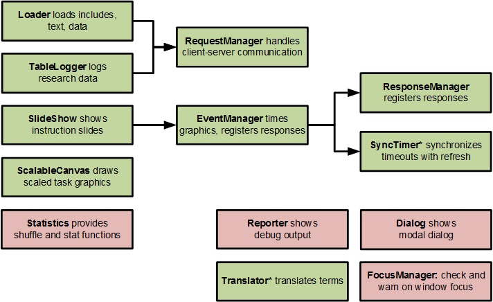

JASMIN
======

How this repository is structured:
* **binaries** Such as pictures used in readme & apps
* **legacy** The old JASMIN; not open source
* **master** The current JASMIN; refactored, documented, and released open source
  * **api_docs** API documentation of each JASMIN module based on JSDoc 3
  * **experiments** Small scripts to try out things
  * **minified** Minified version of jasmin_core (via Closure compiler)
  * **source** Source code
    * **jasmin_apps** Applications built with JASMIN
    * **jasmin_core** The JASMIN library
    * **jasmin_demos** Demos showing features of each JASMIN module
    * **jasmin_ext** External library used in JASMIN (such as jQuery and Screenfull)

# What is JASMIN?
JASMIN (Javascript As Sociopsychological Measurement INstrument) is a library of JavaScript modules for administering questionnaires and response time tasks. JASMIN is aimed to be:
* **Compatible** with major browsers, both on desktops/laptops and smartphones/tablets
* **Online and Offline**, use it without an Internet connection or plug it on a website like Qualtrics and LOTUS
* **Modular**, so you can use parts of it independently
* **Extensible**, JavaScript is has many more support resources than any propriety experiment platform

# Play
* [Select a task](http://mindsurfer.eu/jasmin_demo2/demos/cbm/config.html): select a paradigm, topic, and language and then run the corresponding task out of more than 100 varieties (like an English Cannabis Approach Avoidance Task, an Italian Alcohol Stroop, a Lithuanian Brief Implicit Association Task). 
* [MindSurfer](https://mindsurfer.eu/en/experiment/Test_yourself): Using JASMIN to realize a task and a questionnaire, after which giving feedback on participant's behavior via texts and plots. 

# Learn More
* [Module demos](http://mindsurfer.eu/jasmin3/source/jasmin_demos/RUNME.html). Feature demonstrations of each JASMIN master module.
* [API Documentation](http://mindsurfer.eu/jasmin3/api_docs/). API of each of the JASMIN modules.

Architecture
===================
The graph below shows the JASMIN architecture. An arrow from module A tomodule B means that A requires B. All modules except those marked with a star require jQuery. Green modules have been upgraded and red modules are still to go.

JASMIN Upgrade: Goals
=====================
The legacy JASMIN library has a lot of features and works quite well. However, this library is not open source, not very easy to use, and a bit outdated in some regards. The master JASMIN library aimed to be open surce, proving upgraded modules that are accessible and up-to-date.

JASMIN Upgrade: Approach
===============
Each of the JASMIN modules:
* Is refactored and upgraded, see: **master/source/jasmin_core**
* Has the API is documented via JSDoc 3, see: **master/apidocs**
* Is demoed and tested via one or more examples, see **master/source/jasmin_demos**

In a later stage, JASMIN applications are built to illustrate how the library can be used to program a response time tasks. As apps evolve we hope to have them serve as more complex examples and provide guidelines for best practices.
